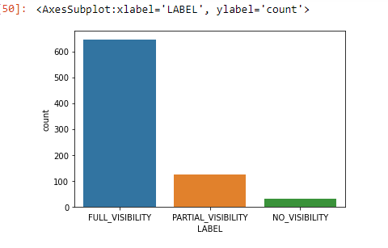
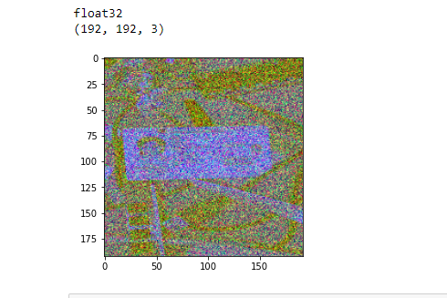
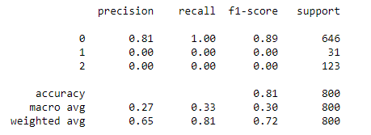

***

# Classifying the visibility of ID cards in photos

The folder images inside data contains several different types of ID documents taken in different conditions and backgrounds. The goal is to use the images stored in this folder and to design an algorithm that identifies the visibility of the card on the photo (FULL_VISIBILITY, PARTIAL_VISIBILITY, NO_VISIBILITY).

## Data

Inside the data folder you can find the following:
sample of image present in dataset

### 1) Folder images
A folder containing the challenge images.

### 2) gicsd_labels.csv
A CSV file mapping each challenge image with its correct label.
	- **IMAGE_FILENAME**: The filename of each image.
	- **LABEL**: The label of each image, which can be one of these values: FULL_VISIBILITY,
                                                                            PARTIAL_VISIBILITY 
                                                                            NO_VISIBILITY. 
###### Summary
1. Data exploration and preprocessing determined that out of the 800 images provided (each size; 192x192), 646 were labelled FULL_VISIBILITY, 123 were labelled PARTIAL_VISIBILITY and 31 were labelled NO_VISIBILITY.
2. The data contained no missing values or duplications.
3. Images were split in to 3 separate folders by their visibility classification.
In new_images folder images were segmented in three folders as FULL_vISIBLTY,PARTIAL_VISIBILITY,NO_VISIBILITY. 

## Approach

Create the CNN model based on that datset and start training 
We have two ipynb files as 1.CNN.ipynb(includes preprocessing,image segmentation and base model CNN)
                           2.data_augmentation.ipynb(includes data augmentation, model evaluation, function to convert image to single     channel
Display model evaluations 
Applied Data Augmentation io increase sample size

Images converted from RGB into single-channel arrays for feature engineering. Methods used included:

[TODO: Complete this section with a brief summary of the approach]

## Future Work

Experiment with other image preprocessing techniques to see if they impove the model e.g.
1. edge dilation (growing boundary regions)
2. Filling in of image region boundary pixels
3. Gaussian blurring to reduce noise (due to image corruptions)
4. Contrasting, Histogram Equalisations